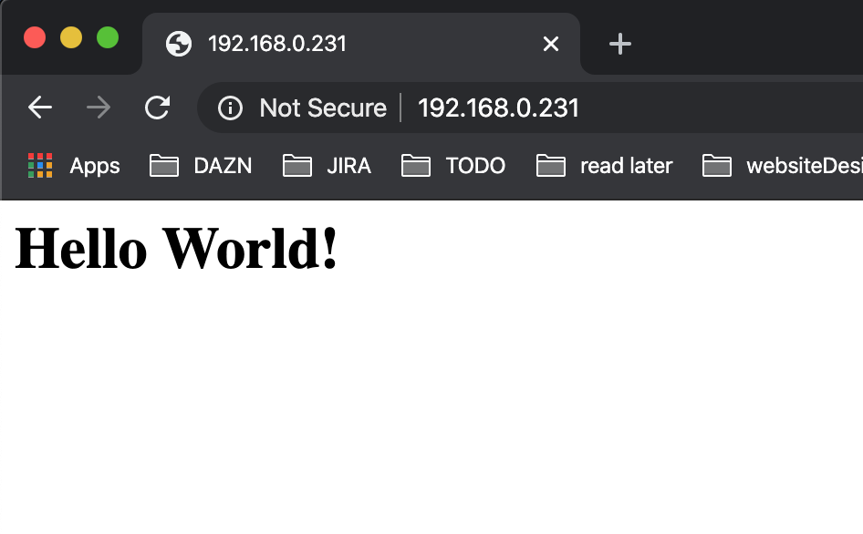

# Data Persistence

The kubernetes [volume](https://kubernetes.io/docs/concepts/storage/volumes/) abstraction provides an explicit lifetime that outlives any of the containers that run in a Pod, providing preserved data across container restarts. Only when a Pod ceases to exists the volume will cease to exist.

## Formatting the disk

Chances are that you have formatted the hard drive in a Mac, which would create a `hfsplus` filesystem. In order to have read and write permissions you would need to install the hfs drive and do some other fiddly bits as documented [here](https://askubuntu.com/questions/332315/how-to-read-and-write-hfs-journaled-external-hdd-in-ubuntu-without-access-to-os).

Instead you can just flush the drive to use one of the available file systems.

```
mkfs.ext3 /dev/sda2
```

## Mounting a storage device

External storage configuration is described [here](https://www.raspberrypi.org/documentation/configuration/external-storage.md).

- Plug your hard drive to one of your slave nodes and find its location

```
sudo lsblk -o UUID,NAME,FSTYPE,SIZE,MOUNTPOINT,LABEL,MODEL

## output
UUID                                 NAME        FSTYPE    SIZE MOUNTPOINT LABEL      MODEL
                                     sda                 931.5G                       ST1000LM024_HN-
826A-0900                            ├─sda1      vfat      200M            EFI
1a3f4df4-bbb4-37d7-8aec-0daf4f74e895 └─sda2      hfsplus 931.2G            k8s-volume
                                     mmcblk0              29.8G
5203-DB74                            ├─mmcblk0p1 vfat      256M /boot      boot
2ab3f8e1-7dc6-43f5-b0db-dd5759d51d4e └─mmcblk0p2 ext4     29.6G /          rootfs
```

- Mount disk
```
ls /dev/ | grep sd # Locate the disk partition
sudo mkdir /mnt/k8s-volume # create volume directory
sudo mount /dev/sda2 /mnt/k8s-volume # mount disk
```

## Install the NFS server

```
sudo apt-get update
sudo apt-get upgrade
sudo apt-get install nfs-kernel-server -y
```

## Start the server

```
sudo systemctl start nfs-server
sudo systemctl status nfs-server # verify is running
```

## Allocate permissions
In order to have access to your nf-server we need to create some read/write permissions

- Volume permissions ****
  - directories: owner (read/write) group (read)
  - files: owner (read/write) group (read)


```
sudo find /mnt/k8s-volume/ -type d -exec chmod 755 {} \;
sudo find /mnt/k8s-volume/ -type f -exec chmod 644 {} \;
```

- Remote access

```
# find user and group ids
id $(whoami)

sudo nano /etc/exports
# /mnt/k8s-volume		*(rw,sync,no_subtree_check,insecure)
```
The line above will give permissions to all hosts. so be careful!
We can set the permissions to be restrictive per host, let me know if you would like to see how this is done :), in the meantime [here](https://pimylifeup.com/raspberry-pi-nfs/) is a walk through of this setup and [the official docs](https://linux.die.net/man/5/exports) too.


- Export config

```
sudo exportfs -ra # export config
sudo exportfs -v  # see current config
showmount -e # see what is being exported
```

## Mount hard drive from other node in the network

This isn't a required step more of an educational step.
Since we have given global access to our drive we can now access it anywhere from within the network

- Find nodes
```
nmap -sP 192.168.0.1/24 # list nodes

WOKER_NODE_1=192.168.0.28
WOKER_NODE_2=192.168.0.26 # hard drive lives here...

ssh pi@$WOKER_NODE_1 # a woker node

showmount -e $WOKER_NODE_2 # see what is being exported

#output
Export list for 192.168.0.26:
/mnt/k8s-volume *
```

- Access hard drive

```
sudo mkdir /mnt/test
sudo mount -t nfs $WOKER_NODE_2:/mnt/k8s-volume /mnt/test/
ls -al /mnt/test/ # inspect drive
```

- End of test

```
sudo umount /mnt/test/
sudo rm -rf /mnt/test
```

## Create Local Volume

To create a local volume you would need to setup a [persistent volume and a persistent volume claim](https://kubernetes.io/docs/concepts/storage/persistent-volumes/#introduction).
From a very high-level we will be provisioning a piece of storage and allowing access through user requests.

### Persistent Volume

see [manifest](../manifests/dev-raspberry/volumes/persistentVolume.yml)
```
kubectl apply -f manifests/dev-raspberry/volumes/persistentVolume.yml

kubectl get pv

NAME             CAPACITY   ACCESS MODES   RECLAIM POLICY   STATUS   CLAIM                          STORAGECLASS     REASON   AGE
pv-nfs-seagate   1Ti        RWX            Retain           Bound    default/pvc-nfs-seagate-test   seagate-driver            56m
```

### Persistent Volume Claim

see [manifest](../manifests/dev-raspberry/volumes/persistentVolumeClaim.yml)
```
kubectl apply -f manifests/dev-raspberry/volumes/persistentVolumeClaim.yml

kubectl get pv,pvc

# Output

NAME                              CAPACITY   ACCESS MODES   RECLAIM POLICY   STATUS   CLAIM                          STORAGECLASS     REASON   AGE
persistentvolume/pv-nfs-seagate   1Ti        RWX            Retain           Bound    default/pvc-nfs-seagate-test   seagate-driver            4m39s

NAME                                         STATUS   VOLUME           CAPACITY   ACCESS MODES   STORAGECLASS     AGE
persistentvolumeclaim/pvc-nfs-seagate-test   Bound    pv-nfs-seagate   1Ti        RWX            seagate-driver   4m28s
```

## Using the volume in your pod

Now that we have a persistent volume we can access it from within our pod.

Let's deploy an nginx service that feeds from our storage.

```
kubectl deploy -f ../manifests/dev-raspberry/examples/hello-world.yml
```
see [manifest](../manifests/dev-raspberry/examples/hello-world.yml)

we can verify we are reading from the volume by ssh-ing into it

```
kubectl exec -it nginx-pvc-hello-world-xxxx-xxx -- sh
cat /usr/share/nginx/html/index.html

# <h1>Hello World! </h1>
```

```
kubectl expose deploy nginx-pvc-hello-world --port 80 --type LoadBalancer

# Output
NAME                            TYPE           CLUSTER-IP     EXTERNAL-IP     PORT(S)        AGE   SELECTOR
service/nginx-pvc-hello-world   LoadBalancer   10.96.27.209   192.168.0.231   80:32229/TCP   8s    app=nginx
```

<p align="center">
    
</p>

And there you have it!
A bare metal Volume storage served by our bare metal load balancer :)
