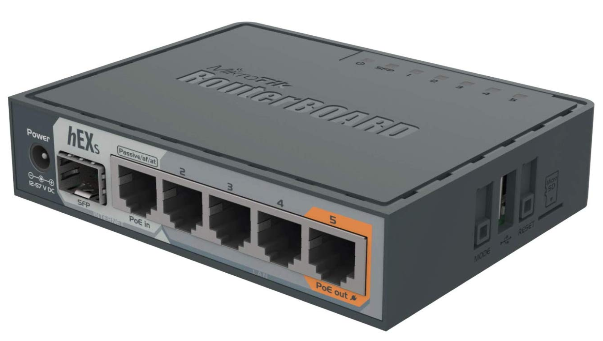

# Equipment

Double check your raspberry pi and memory card conform with the [system requirements](https://kubernetes.io/docs/setup/production-environment/tools/kubeadm/install-kubeadm/#before-you-begin) prescribed for the kubeadm toolbox.

- ## 4 x [Raspberry Pi 4](https://www.raspberrypi.org/products/raspberry-pi-4-model-b/specifications/).

    1 Master Node and 3 Slaves.

    

        
    

- ## 4 x 32GB micro SD card

    

        
    

- ## 1 x Ethernet Switch

    

        
    

    You can also get a POE (Power over Ethernet) switch and use a [POE hat](https://www.raspberrypi.org/products/poe-hat/). Not required, just a nice to have.

- ## 1 x Router (with DHCP support)

    

        
    

- ## Ethernet Cables (1 per node)

    

        
    

- ## MICRO USB / USB-C Cables (1 per node)

    Depending on whether you are using a raspberry pi 3 or 4

    

        
    

- ## USB Charger (make sure it can deliver at least 2amp per port)

    

        
    

- ## A case for the cluster with cooling fans and heat sinks.

    

        
    

- ## External Hard Drive

    

        
    

