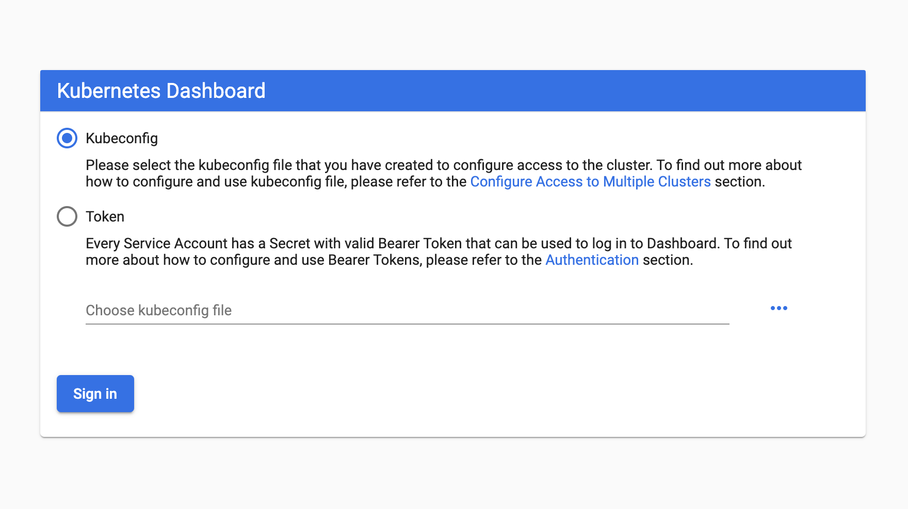
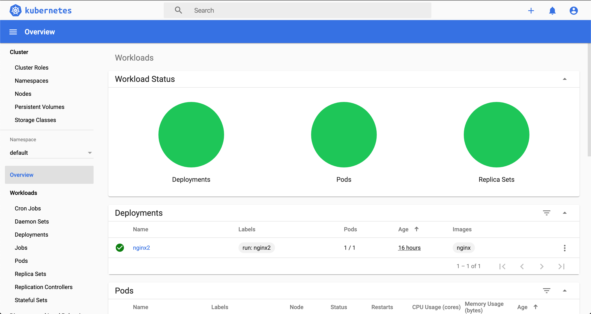

# Kubernetes Dashboard

The kubernetes [dashboard](https://github.com/kubernetes/dashboard) is the quickest way to get started with your cluster. Further along we will be implementing some custom metrics powered by prometheus and grafana though.

## Install

```
kubectl apply -f https://raw.githubusercontent.com/kubernetes/dashboard/v2.0.0-beta8/aio/deploy/recommended.yaml
```

## Access

Since this dashboard has admin access it should only be used for development.

```
kube proxy
open http://localhost:8001/api/v1/namespaces/kubernetes-dashboard/services/https:kubernetes-dashboard:/proxy/#/login
```

<p align="center">
    
</p>

## Generate Token

To generate a token we would need to create an admin user and bind the cluster-admin role to it.

```
apiVersion: v1
kind: ServiceAccount
metadata:
  name: admin-user
  namespace: kubernetes-dashboard

---

apiVersion: rbac.authorization.k8s.io/v1
kind: ClusterRoleBinding
metadata:
  name: admin-user
roleRef:
  apiGroup: rbac.authorization.k8s.io
  kind: ClusterRole
  name: cluster-admin
subjects:
- kind: ServiceAccount
  name: admin-user
  namespace: kubernetes-dashboard
```

Apply these changes `kubectl apply -f config.yml` and generate a token.

```
# Generate Token
kubectl -n kubernetes-dashboard describe secret $(kubectl -n kubernetes-dashboard get secret | grep admin-user | awk '{print $1}')
```

<p align="center">
    
</p>
