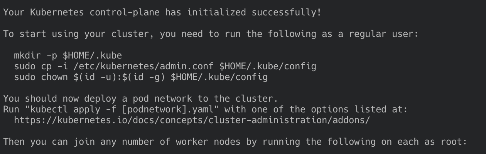

# Manual Installation: Master Node

Refer to the [node installation](./node.md) first.

- [Manual Installation: Master Node](#manual-installation-master-node)
  - [Load kubeadm images and init](#load-kubeadm-images-and-init)
  - [Create the Kube config](#create-the-kube-config)
  - [Node Verification](#node-verification)
  - [Install Container Network Interface (CNI).](#install-container-network-interface-cni)

## Load kubeadm images and init


```
sudo swapoff -a
kubeadm config images pull
sudo kubeadm init --pod-network-cidr=10.244.0.0/16 --token-ttl=0
```


<p align="center">
    
</p>

Save the token and discovery token provided by the initialisation.

```
kubeadm join 192.168.0.25:6443 --token xxx \
    --discovery-token-ca-cert-hash sha256:xxx
```

You can always generate a new token later by doing:

```
KUBE_TOKEN=$(kubeadm token generate)
kubeadm token create $KUBE_TOKEN --print-join-command --ttl=0
```

## Create the Kube config
```
mkdir -p $HOME/.kube
sudo cp -i /etc/kubernetes/admin.conf $HOME/.kube/config
sudo chown $(id -u):$(id -g) $HOME/.kube/config
```

## Node Verification
```
pi@k8s-master:~ $ kubectl get nodes
NAME         STATUS     ROLES    AGE   VERSION
k8s-master   NotReady   master   55m   v1.17.0
```

For the node to become ready we need to install a container network.

## Install Container Network Interface (CNI).

Apply one of the widely [available layers](https://kubernetes.io/docs/concepts/cluster-administration/networking/#the-kubernetes-network-model).

```
curl -sSL https://rawgit.com/coreos/flannel/master/Documentation/kube-flannel.yml | sed "s/amd64/arm/g" | kubectl create -f -
```

You can read more about [flannel here](https://github.com/coreos/flannel). Make sure you replace amd64 with arm, not arm64 as one would think. Those images do not exist. At the time of this report the commit version that was applied to [master](https://github.com/coreos/flannel) was `960b3243b9a7faccdfe7b3c09097105e68030ea7`. You can run this commit instead if you would like to fetch the same version.

```
curl -sSL https://rawgit.com/coreos/flannel/960b3243b9a7faccdfe7b3c09097105e68030ea7/Documentation/kube-flannel.yml | sed "s/amd64/arm/g" | kubectl create -f -
```
