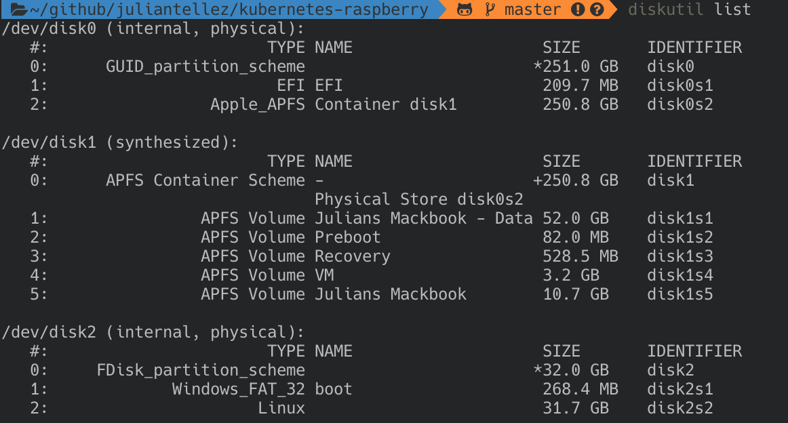

# Flushing the Operating System

The Raspberry PI nodes are provisioned using [Raspbian Buster](https://www.raspberrypi.org/downloads/raspbian/). A light weight version of Raspbian Buster.

- Download and unzip the iso image from the link above

- Locate the SD card

  ```sh
  diskutil list
  ```

  <p align="center">
      
  </p>

- Unmount the disk

  ```sh
  diskutil unmountDisk /dev/disk2
  ```

- dd the image into the disk

  ```
  sudo dd if=<path-to-image>/raspbian.img of=/dev/rdisk2 bs=1m
  ```

- Enable ssh 

  ```
  cd /Volumes/system-boot
  touch ssh
  ```
