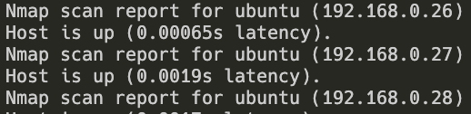

# SSH into Raspberry PI

Makes the assumption that you have enabled ssh when [flushing the drive](./os_flushing.md).

 - Install nmap
    ```sh
    brew install nmap
    ```

 - Find the device's IP address

    ```sh
    # Find the Router's IP
    netstat -nr | grep default

    # Inspect nodes on local network
    nmap -sP 192.168.0.1/24
    ```

    <p align="center">
      
    </p>

 - ssh into nodes

    ```sh
    # ssh into device, pswd is usually "raspberry"
    ssh pi@192.168.0.xx
    ```
